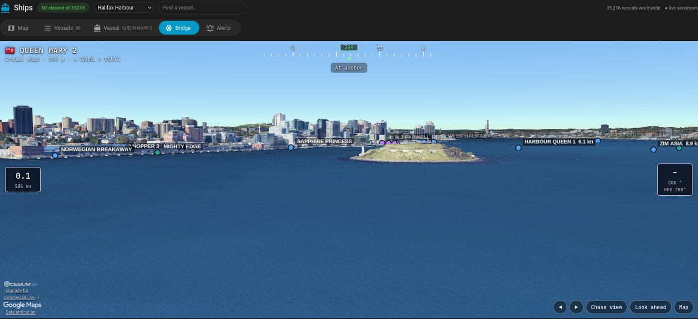
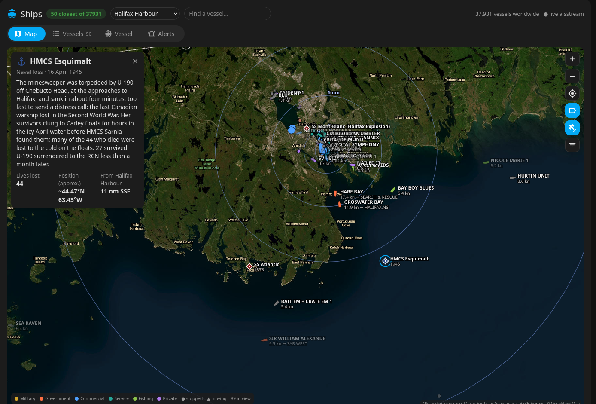
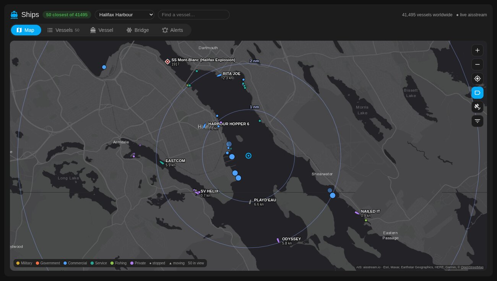

# ais-monitor + Ships card

**Marine traffic, live from AIS: the vessels closest to a place you choose. A Home Assistant card, or a dashboard on
its own in any browser.**

The companion to [adsb-monitor](https://github.com/jchisholm59/adsb-monitor) (aircraft), in the same style.




| Worldwide | Vessel details |
|---|---|
|  |  |

| Satellite: the Halifax Explosion | Sable Island wrecks |
|---|---|
|  |  |

| North Atlantic wrecks | Halifax approaches: HMCS Esquimalt |
|---|---|
|  |  |

| Vessels | Locations | Alerts |
|---|---|---|
|  |  |  |

Two pieces:

- **`ships-card`**: a Lovelace card. The header has a **location list** (the list is measured from it; *Manage
  locations…* adds places by name search or the map centre, removes them and picks the default) and a **vessel search**
  (name, MMSI, IMO or callsign; flies the map to it). Tabs:
  - **Map**: every vessel in view as you pan and zoom (with `WORLDWIDE=true`, anywhere aisstream covers; thinned
    to the largest 1,500 when zoomed far out), as hulls pointing along their course when moving and dots when moored or
    at anchor, coloured by class, with range rings around the location, a class filter and a **satellite** imagery button. The filter also shows **wrecks**: 43 major shipwrecks and naval losses (Titanic, Lusitania, the Halifax Explosion, Empress of Ireland, Sable Island's "Graveyard of the Atlantic", Hood, Bismarck, Arizona, Yamato…), each with its date, lives lost and story; positions marked approximate where the exact site isn't public. Tap one for a popup and its
    recent track.
  - **Vessels**: a sortable list with flag, class, type, status, speed, course, distance, destination, length and
    last seen. Filter chips by class; 📍 jumps to the vessel on the map.
  - **Vessel**: flag and country, name, class, type, size, draught, MMSI / IMO / callsign, speed, course and heading,
    distance and bearing from the location, the destination and ETA the crew reported, a speed chart, and links to
    MarineTraffic, VesselFinder and MyShipTracking.
  - **Bridge**: stand on the selected vessel's bridge. Its view over Google's photorealistic 3D world (CesiumJS,
    loaded only when you open the tab), driven by the live AIS: the camera sits at the ship's reported position, at a
    bridge height scaled from its length (from ~4 m on a small boat to ~45 m on the largest cruise ships), looking
    along its true heading, or its course over ground when it doesn't send one. Between reports (AIS is slower than
    ADS-B) it carries on at the reported speed and course and eases onto each new position, so the view glides
    rather than jumps. Other vessels show as dots in their class colours with names and speeds. A HUD with flag,
    name, type, length and destination, navigational status, a heading tape (with a yellow mark where it's actually
    going), speed and course over ground and the heading. Drag to look around, wheel to zoom, **Chase view** to watch
    the ship from astern, ◀ ▶ to hop between vessels. Ships don't report their pitch or roll, so the deck stays level.
    Needs a free [Cesium ion](https://ion.cesium.com/) token: paste it into the tab once (it's saved to your Home
    Assistant profile; one already pasted into the [SkyAware card](https://github.com/jchisholm59/adsb-monitor)'s
    Cockpit tab is used too). Wants a decent GPU; fine on desktops and phones. It's the companion to that card's
    cockpit view, after [God's Eye View](https://github.com/bilawalsidhu/gods-eye-view)'s. GEV's own cockpit
    flies aircraft only (selecting a vessel there flies the camera to it once, without following it; checked against
    its source in October 2026), so riding along on a ship's bridge, live on its real course, is this card's own.
  - **Alerts**: phone alerts for **warships** and **cruise ships** (optionally Coast Guard ships) **entering a
    harbour**, and which harbours to watch.
- **`ais-monitor`**: a small always-on Node service (no dependencies) that holds one connection to
  [aisstream.io](https://aisstream.io), a free AIS feed that needs a key. It keeps a table of every vessel heard in
  the areas you choose, and serves the closest ones to the card. Your key stays on your server; aisstream doesn't
  allow browser connections anyway.

## Three ways to use it
| | In Home Assistant | As a Home Assistant add-on | On its own |
|---|---|---|---|
| **For** | any HA install | **HA OS** (or Supervised): everything on the HA box | anyone, no HA needed |
| **Open it** | a dashboard view with the `custom:ships-card` card | **Ships** in HA's sidebar (and the card, if you like) | **`http://<monitor>:7110/`** in any browser, or *Add to Home screen* on a phone |
| **Install** | the card from HACS (or by hand) + the monitor | add [`jchisholm59/ha-addons`](https://github.com/jchisholm59/ha-addons) to the Add-on Store, install **AIS Monitor** | the monitor: `git clone` + **`./install.sh`** (Node.js 22+, no dependencies) |
| **Settings** | the monitor's `.env` | the add-on's Configuration tab | `.env` (asked for by `install.sh`) |
| **Phone alerts** | HA companion app, through a webhook automation | the same | the free [ntfy](https://ntfy.sh) app (or both) |
| **3D view** token | pasted once, kept in your HA profile | the same | pasted once per browser |

Same card, same features every way: the monitor serves it with a small stand-in for the bits it normally takes from
Home Assistant. Details in [Without Home Assistant](#without-home-assistant) and the
[add-on's documentation](https://github.com/jchisholm59/ha-addons/blob/main/ais-monitor/DOCS.md).

## Classes
From the AIS ship type each vessel broadcasts, plus its name:

| Class | From |
|---|---|
| **Military** | type 35, or a navy prefix: HMCS / CFAV → RCN, USS / USNS → USN, HMS / RFA → RN, and other navies; the tag shows the navy |
| **Government** | search and rescue (51), law enforcement (55), and names like CCGS, USCGC, RCMP, POLICE, COAST GUARD |
| **Commercial** | passenger (cruise ship if 200 m or more, otherwise passenger / ferry), cargo, tanker, high-speed craft |
| **Service** | tug, towing, pilot vessel, dredging, diving, port tender, anti-pollution, medical |
| **Fishing** | fishing |
| **Private** | sailing and pleasure craft |
| **Other** | any other type |
| **Unknown** | no type received yet |

Flags come from the MMSI's country digits (316 Canada, 338/366–369 USA, 232–235 UK, 636 Liberia, 538 Marshall Islands,
351–357 Panama…).

**Coverage:** aisstream is built from shore-based receivers, so busy coasts (Europe, North America, parts of Asia) are
well covered out to roughly 40–60 nm, and the open ocean mostly isn't. Apps that show ships mid-ocean add paid
satellite AIS.

**Patience:** ships send their name and type only every 6 minutes, and aisstream is built from volunteer receivers,
so a newly seen vessel shows as "Waiting for details" for a while. The monitor remembers names and types for 30
days, so the picture fills in over the first hours and stays filled. Many small craft (class B transponders) never
send a type.

## Harbour alerts
A vessel "enters a harbour" when it crosses into a circle (6 nm by default) around one of your locations, having been
seen outside it within the last 6 hours, so ships already in port when the monitor starts never alert. The alert
fires once its class is known: a warship by its navy prefix or type 35 (often from the name alone), a cruise ship by
type 60–69 and length ≥ 200 m (its details can arrive after it has crossed; it still alerts while inside). The same
vessel doesn't alert again for 12 h. Example:

> ⚓ **RCN warship entering Halifax Harbour**
> HMCS HALIFAX · Royal Canadian Navy · Canada
> 12.0 kn, 4.6 nm from Halifax Harbour

**Leaving** (switch: *…and when they leave*): the same ships crossing back out, half a mile past the circle so one
anchored on its edge doesn't flip-flop, after at least 30 minutes inside (ships already in port when the monitor
starts count). It uses the same notification tag, so on the phone it replaces the arrival notification if that's
still there. Example:

> 🛳️ **Cruise ship leaving Halifax Harbour**
> QUEEN MARY 2 · 345 m · Bermuda
> 18.2 kn, 6.6 nm from Halifax Harbour, destination USNYC

**Photos**: both alerts carry a photo of the ship when one can be found: the main image of the ship's
[Wikidata](https://www.wikidata.org/) item (a hand-picked exterior shot, not a random one from the ship's gallery),
found by IMO number, then MMSI, then by name when the item is described as a ship, frigate and so on. Most cruise
ships and warships have one; small craft usually don't, and alert without. Lookups are cached in `data/photos.json`.

Alerts go to a Home Assistant webhook automation ([`ha-automation.yaml`](ha-automation.yaml)) and/or to ntfy (see
[Without Home Assistant](#without-home-assistant)). The HA automation sends
**persistent** notifications: they stay until you tap **Dismiss** (handled by [`alert-dismiss.yaml`](alert-dismiss.yaml));
**Open** goes to the Ships view. A plain copy goes to a Wear OS watch, since Android doesn't pass persistent
notifications on to the watch. Turn types on or off, set the circle and pick harbours in the
card's Alerts tab; there's a test button and the recent alerts.

## Requirements
- A free **aisstream.io** API key: sign in at aisstream.io, then *API Keys*. A key allows only a limited number of
  simultaneous connections, so run one monitor per key.
- **Home Assistant** for the card, **or** nothing: the monitor serves the dashboard itself and can send alerts through
  ntfy (see [Without Home Assistant](#without-home-assistant)).
- For the monitor: **Node.js 22+** (for its built-in WebSocket) on any always-on machine, kept running with pm2 or
  systemd.

## Install

### 1. The monitor
**Quick:** clone it and run the installer. It checks Node.js 22+, installs pm2 if needed, asks for the main settings
(aisstream.io key, your locations, ntfy and/or HA webhook), writes them to `.env`, and starts the monitor under pm2 so it survives reboots:
```bash
git clone https://github.com/jchisholm59/ais-monitor.git
cd ais-monitor && ./install.sh
```
Run `./install.sh` again any time to change those settings. **On HA OS**, use the add-on instead (see
[Three ways to use it](#three-ways-to-use-it)).

**By hand**, if you prefer:
```bash
git clone https://github.com/jchisholm59/ais-monitor.git
cd ais-monitor
cp .env.example .env
nano .env                         # AISSTREAM_KEY, LOCATIONS
chmod 600 .env
pm2 start ecosystem.config.js && pm2 save
curl http://localhost:7110/api/status
```

### 2. The card
**With HACS:** HACS → ⋮ → Custom repositories → add `https://github.com/jchisholm59/ais-monitor`, type *Dashboard*,
then download **Ships Card (AIS)**.

**By hand:** copy `dist/ships-card.js` and `dist/ships-bridge.js` to `/config/www/` and add `/local/ships-card.js` as a
*JavaScript module* resource (Settings → Dashboards → ⋮ → Resources). `ships-bridge.js` is loaded by the card when
its Bridge tab opens; it isn't a resource of its own.

**Then** add a view (a *Panel* view gives the map the whole screen) with:
   ```yaml
   type: custom:ships-card
   monitor:
     - http://192.168.1.20:7110      # ais-monitor on your LAN
     - http://100.64.0.10:7110       # optional: over Tailscale/VPN, for away from home
   ```

## Without Home Assistant



The monitor serves the whole dashboard on its own port: open **`http://<monitor>:7110/`** in any browser. It's the same
card, with the few things it normally takes from Home Assistant provided by a small page in `web/` (a card frame, the
Material Design icons it uses, light and dark colours that follow your system setting). Everything works the same: map,
vessels, vessel details, the **Bridge** view (the Cesium token is kept in that browser, or set `CESIUM_TOKEN`), wrecks and alerts. On a phone,
use your browser's **Add to Home screen**: it opens full screen like an app.

- **Card options**: put any of them in the monitor's `data/card.json`, e.g. `{"title": "Harbour", "n": 30}`. The page
  points the card at the monitor itself, so `monitor` isn't needed.
- **Phone alerts with [ntfy](https://ntfy.sh)** instead of (or as well as) Home Assistant: install the ntfy app,
  subscribe to a topic with a long random name (anyone who knows it can read it), and set
  `NTFY_URL=https://ntfy.sh/<your-topic>` in the monitor's `.env` (or your own ntfy server's URL, with `NTFY_TOKEN` if
  it needs one). Arrivals and departures come with their title, priority, a tag icon and the ship's photo;
  `DASHBOARD_URL=http://<monitor>:7110/` makes tapping one open the dashboard. Test it from the Alerts tab.
- The JSON list of endpoints, formerly at `/`, is at `/api`.

### Sharing it with guests

To let other people look at your dashboard without being able to change anything, set a password in the monitor's
`.env`:

```
ADMIN_PASSWORD=pick-a-long-one
CESIUM_TOKEN=your-cesium-ion-token   # optional: lets guests use the Bridge view without a token of their own
```

Guests then see everything except the Alerts tab, which shows **Viewing as a guest** and a sign-in box. Signing in with
the password unlocks it: alert settings, editing the saved locations and test alerts. The browser (or, in the Home Assistant card, your HA
profile) remembers you until you **Sign out**, and changing the password signs everyone out. The monitor enforces it,
not just the page: without the sign-in token, every change request is refused, and five wrong passwords lock that
address out for 15 minutes. With no `ADMIN_PASSWORD`, nothing changes: no sign-in, everything open, as before.

- `CESIUM_TOKEN` is handed to every visitor, so create one with only `assets:read`, and add your shared address to its
  Allowed URLs if you restrict them. Guest use counts against your Cesium ion quota.
- To put it on the internet, use a tunnel (Cloudflare Tunnel, Tailscale Funnel) rather than opening a port on your
  router. Don't rely on "only trust my LAN" instead of a password: through a tunnel, every visitor arrives from your LAN.

## Configuration

### `.env` (monitor)
| Variable | Default | |
|---|---|---|
| `AISSTREAM_KEY` | none | Your aisstream.io key |
| `LOCATIONS` | none | `Name:lat,lon;Name:lat,lon`. The starting places the card can list the closest vessels to; the first is the default. Once edited in the card they're kept in `data/locations.json` |
| `LOCATION_RADIUS_NM` | `40` | AIS is received for a box this size around each location |
| `AREA_LAT`, `AREA_LON`, `AREA_RADIUS_NM` | none, `100` | Optional wider area to receive as well |
| `WORLDWIDE` | `false` | `true`: receive every vessel aisstream has (about 100–150 messages/s, ~6.5 GB/day download, ~100–200 MB RAM). Otherwise only the boxes around your locations |
| `CLOSEST` | `50` | Default number of closest vessels |
| `HA_WEBHOOK` | none | HA webhook URL for phone alerts |
| `NTFY_URL` | none | ntfy topic URL for phone alerts without HA, e.g. `https://ntfy.sh/<long-random-topic>`. With neither this nor `HA_WEBHOOK`, alerts are only logged |
| `NTFY_TOKEN` | none | Only for a protected ntfy server or topic |
| `DASHBOARD_URL` | none | Opened when you tap an ntfy alert, e.g. `http://192.168.1.20:7110/` |
| `ALERT_RADIUS_NM` | `6` | Starting harbour circle for alerts; then set in the card |
| `ADMIN_PASSWORD` | none | Guests can look but not change anything; sign in on the Alerts tab (see [Sharing it with guests](#sharing-it-with-guests)) |
| `CESIUM_TOKEN` | none | Cesium ion token for the Bridge tab, for everyone using the dashboard (and guests) |
| `ADMIN_TRUSTED_IPS` | none | Addresses always treated as signed in (the HA add-on sets Home Assistant's ingress proxy) |
| `PORT` | `7110` | |

### Card options
| Option | Default | |
|---|---|---|
| `monitor` | (required) | ais-monitor URLs, tried in order |
| `title` | `Ships` | |
| `n` | `50` | How many closest vessels |
| `rings` | `[1, 2, 5, 10, 25]` | Range rings around the location, nm |
| `refresh` | `10` | Seconds between updates |
| `map_height` | fills the screen | px |
| `cesium_token` | none | Cesium ion token for the Bridge tab. Easier: paste it into the tab (saved to your HA profile). Create it with only `assets:read` and restrict its Allowed URLs to your HA addresses: anyone who can open the dashboard can read it |
| `monitor_token` | none | With `ADMIN_PASSWORD` on the monitor: easier to sign in on the Alerts tab (saved to your HA profile) |
| `markers` | `[]` | Your own landmarks on the map: a list like `- {name: Sable Island, lat: 43.93, lon: -59.91, sub: Graveyard of the Atlantic, note: ...}`. `false` also hides the shipwrecks |

The header's location list also has **Centre of the map…**, which lists the vessels closest to wherever the map is
centred (inside the areas the monitor receives).

## API
| | |
|---|---|
| `GET /api/status` | connection, message count, areas, locations, vessel counts |
| `GET /api/vessels?lat=&lon=&n=` | the `n` closest vessels to a point, with class, flag, distance and bearing |
| `GET /api/vessels?bbox=s,w,n,e&limit=` | vessels in a map view, thinned evenly when there are more than `limit` |
| `GET /api/search?q=` | vessels by name, MMSI, IMO or callsign |
| `GET / POST /api/locations` | the locations; POST `{op: "add" \| "remove" \| "default", name, lat, lon}` |
| `GET /api/vessel/<mmsi>?lat=&lon=` | one vessel, with its last 2 hours of track |
| `GET / PUT /api/settings` | alert settings |
| `GET /api/alerts` | last 100 alerts |
| `POST /api/test-alert` | send a test notification |
| `GET /api/auth`, `POST /api/login` | with `ADMIN_PASSWORD`: whether this request is signed in; `{password}` → `{token}`, sent as `Authorization: Bearer <token>` (needed for settings, alerts, test alerts and changing locations) |

## Notes
- Destinations and ETAs are typed in by the crew and are often stale or abbreviated (e.g. "CA HAL").
- Warships often switch AIS off or send little; many small boats have no AIS.
- Anyone who can reach the monitor's port can read the vessel list. Without `ADMIN_PASSWORD` they can also change the
  alert settings and locations: keep it on your LAN or VPN, or set one (see [Sharing it with guests](#sharing-it-with-guests)).
- Map: Esri World Gray Canvas and World Imagery (Esri, Maxar, Earthstar Geographics, HERE, Garmin, © OpenStreetMap contributors). AIS data: aisstream.io.

## License
MIT
