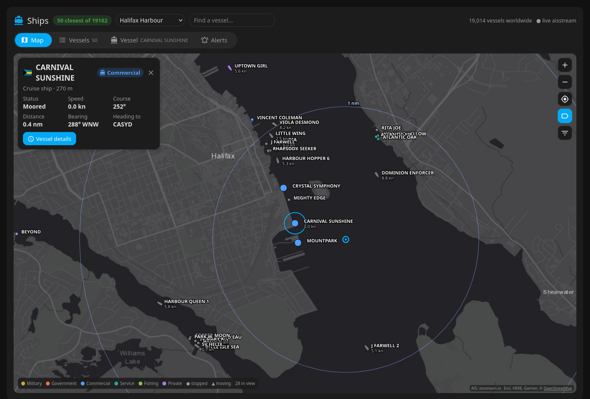
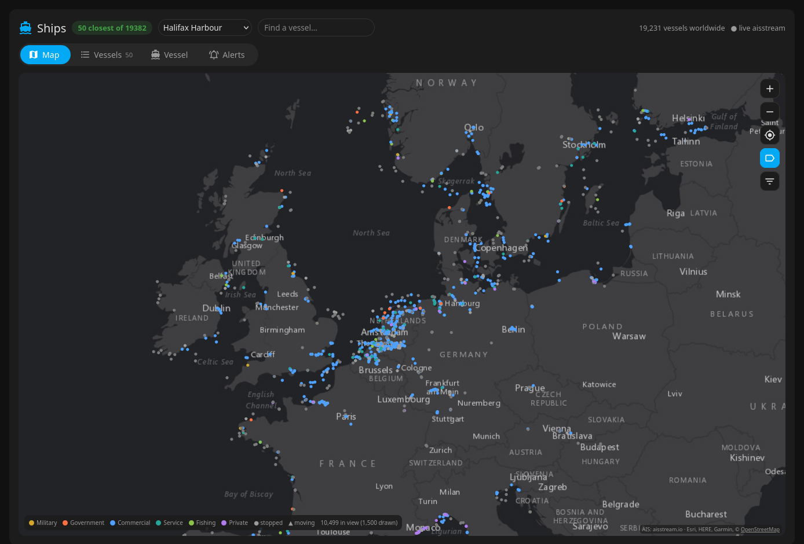
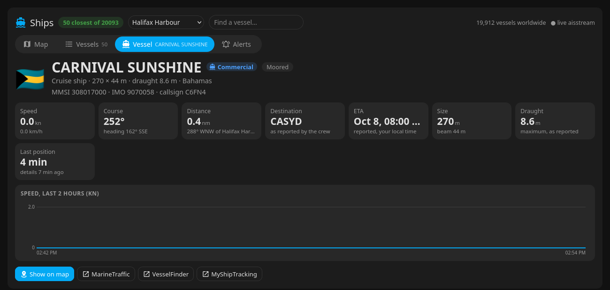
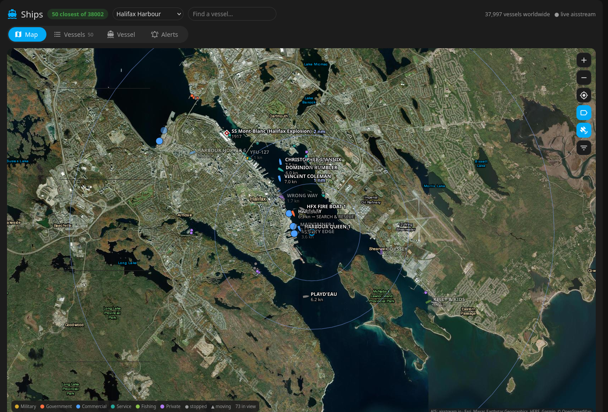
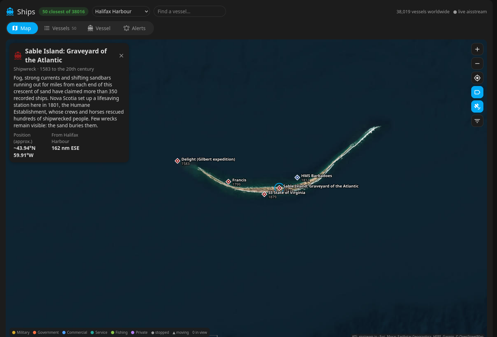
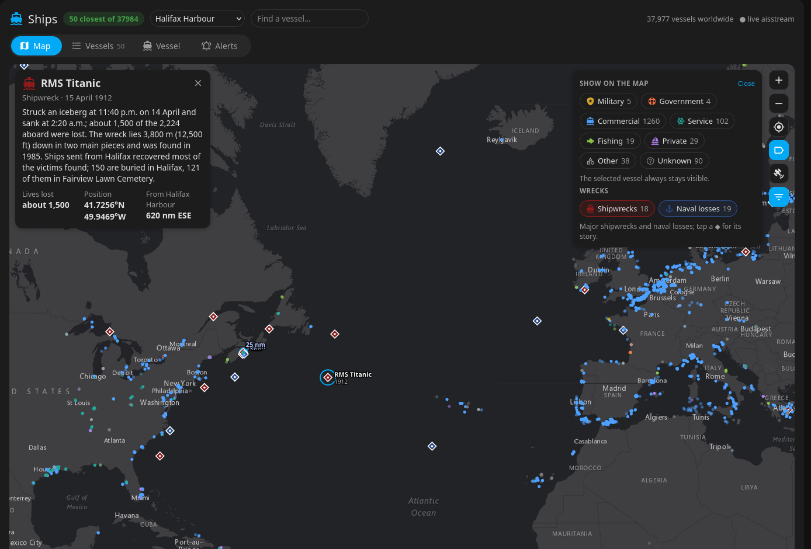
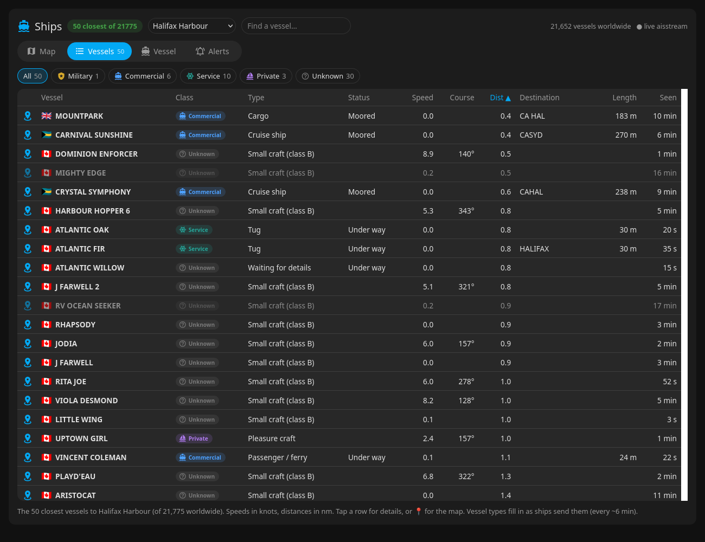
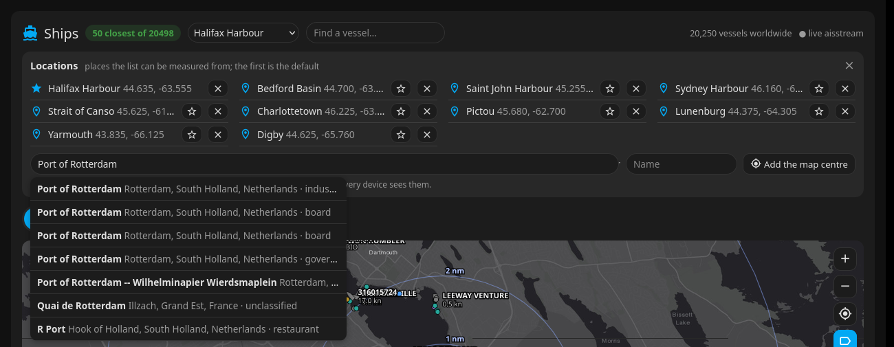
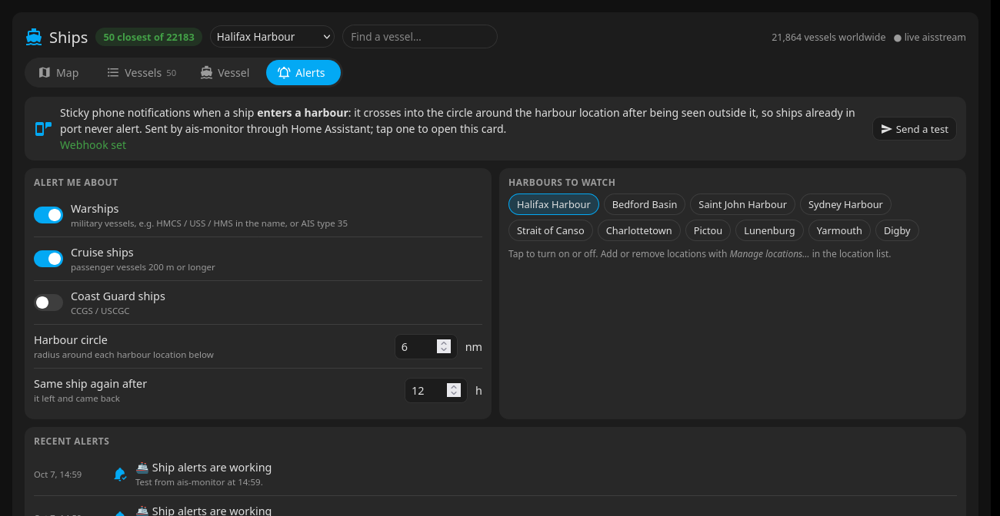

# ais-monitor + Ships card

**A Home Assistant card for marine traffic: the vessels closest to a place you choose, live from AIS.**

The companion to [adsb-monitor](https://github.com/jchisholm59/adsb-monitor) (aircraft), in the same style.



| Worldwide | Vessel details |
|---|---|
|  |  |

| Satellite | Sable Island wrecks |
|---|---|
|  |  |



| Vessels | Locations | Alerts |
|---|---|---|
|  |  |  |

Two pieces:

- **`ships-card`**: a Lovelace card. The header has a **location list** (the list is measured from it; *Manage
  locations…* adds places by name search or the map centre, removes them and picks the default) and a **vessel search**
  (name, MMSI, IMO or callsign; flies the map to it). Tabs:
  - **Map**: every vessel in view as you pan and zoom (with `WORLDWIDE=true`, anywhere aisstream covers; thinned
    to the largest 1,500 when zoomed far out), as hulls pointing along their course when moving and dots when moored or
    at anchor, coloured by class, with range rings around the location, a class filter and a **satellite** imagery button. The filter also shows **wrecks**: 43 major shipwrecks and naval losses (Titanic, Lusitania, the Halifax Explosion, Empress of Ireland, Sable Island's "Graveyard of the Atlantic", Hood, Bismarck, Arizona, Yamato…), each with its date, lives lost and story; positions marked approximate where the exact site isn't public. Tap one for a popup and its
    recent track.
  - **Vessels**: a sortable list with flag, class, type, status, speed, course, distance, destination, length and
    last seen. Filter chips by class; 📍 jumps to the vessel on the map.
  - **Vessel**: flag and country, name, class, type, size, draught, MMSI / IMO / callsign, speed, course and heading,
    distance and bearing from the location, the destination and ETA the crew reported, a speed chart, and links to
    MarineTraffic, VesselFinder and MyShipTracking.
  - **Alerts**: phone alerts for **warships** and **cruise ships** (optionally Coast Guard ships) **entering a
    harbour**, and which harbours to watch.
- **`ais-monitor`**: a small always-on Node service (no dependencies) that holds one connection to
  [aisstream.io](https://aisstream.io), a free AIS feed that needs a key. It keeps a table of every vessel heard in
  the areas you choose, and serves the closest ones to the card. Your key stays on your server; aisstream doesn't
  allow browser connections anyway.

## Classes
From the AIS ship type each vessel broadcasts, plus its name:

| Class | From |
|---|---|
| **Military** | type 35, or a navy prefix: HMCS / CFAV → RCN, USS / USNS → USN, HMS / RFA → RN, and other navies; the tag shows the navy |
| **Government** | search and rescue (51), law enforcement (55), and names like CCGS, USCGC, RCMP, POLICE, COAST GUARD |
| **Commercial** | passenger (cruise ship if 200 m or more, otherwise passenger / ferry), cargo, tanker, high-speed craft |
| **Service** | tug, towing, pilot vessel, dredging, diving, port tender, anti-pollution, medical |
| **Fishing** | fishing |
| **Private** | sailing and pleasure craft |
| **Other** | any other type |
| **Unknown** | no type received yet |

Flags come from the MMSI's country digits (316 Canada, 338/366–369 USA, 232–235 UK, 636 Liberia, 538 Marshall Islands,
351–357 Panama…).

**Coverage:** aisstream is built from shore-based receivers, so busy coasts (Europe, North America, parts of Asia) are
well covered out to roughly 40–60 nm, and the open ocean mostly isn't. Apps that show ships mid-ocean add paid
satellite AIS.

**Patience:** ships send their name and type only every 6 minutes, and aisstream is built from volunteer receivers,
so a newly seen vessel shows as "Waiting for details" for a while. The monitor remembers names and types for 30
days, so the picture fills in over the first hours and stays filled. Many small craft (class B transponders) never
send a type.

## Harbour alerts
A vessel "enters a harbour" when it crosses into a circle (6 nm by default) around one of your locations, having been
seen outside it within the last 6 hours, so ships already in port when the monitor starts never alert. The alert
fires once its class is known: a warship by its navy prefix or type 35 (often from the name alone), a cruise ship by
type 60–69 and length ≥ 200 m (its details can arrive after it has crossed; it still alerts while inside). The same
vessel doesn't alert again for 12 h. Example:

> ⚓ **RCN warship entering Halifax Harbour**
> HMCS HALIFAX · Royal Canadian Navy · Canada
> 12.0 kn, 4.6 nm from Halifax Harbour

Alerts go to a Home Assistant webhook automation ([`ha-automation.yaml`](ha-automation.yaml)), which sends
**persistent** notifications: they stay until you tap **Dismiss** (handled by [`alert-dismiss.yaml`](alert-dismiss.yaml));
**Open** goes to the Ships view. A plain copy goes to a Wear OS watch, since Android doesn't pass persistent
notifications on to the watch. Turn types on or off, set the circle and pick harbours in the
card's Alerts tab; there's a test button and the recent alerts.

## Requirements
- A free **aisstream.io** API key: sign in at aisstream.io, then *API Keys*. A key allows only a limited number of
  simultaneous connections, so run one monitor per key.
- **Home Assistant** for the card.
- For the monitor: **Node.js 22+** (for its built-in WebSocket) on any always-on machine, kept running with pm2 or
  systemd.

## Install

### 1. The monitor
```bash
git clone https://github.com/jchisholm59/ais-monitor.git
cd ais-monitor
cp .env.example .env
nano .env                         # AISSTREAM_KEY, LOCATIONS
chmod 600 .env
pm2 start ecosystem.config.js && pm2 save
curl http://localhost:7110/api/status
```

### 2. The card
**With HACS:** HACS → ⋮ → Custom repositories → add `https://github.com/jchisholm59/ais-monitor`, type *Dashboard*,
then download **Ships Card (AIS)**.

**By hand:** copy `dist/ships-card.js` to `/config/www/` and add `/local/ships-card.js` as a *JavaScript module*
resource (Settings → Dashboards → ⋮ → Resources).

**Then** add a view (a *Panel* view gives the map the whole screen) with:
   ```yaml
   type: custom:ships-card
   monitor:
     - http://192.168.1.20:7110      # ais-monitor on your LAN
     - http://100.64.0.10:7110       # optional: over Tailscale/VPN, for away from home
   ```

## Configuration

### `.env` (monitor)
| Variable | Default | |
|---|---|---|
| `AISSTREAM_KEY` | none | Your aisstream.io key |
| `LOCATIONS` | none | `Name:lat,lon;Name:lat,lon`. The starting places the card can list the closest vessels to; the first is the default. Once edited in the card they're kept in `data/locations.json` |
| `LOCATION_RADIUS_NM` | `40` | AIS is received for a box this size around each location |
| `AREA_LAT`, `AREA_LON`, `AREA_RADIUS_NM` | none, `100` | Optional wider area to receive as well |
| `WORLDWIDE` | `false` | `true`: receive every vessel aisstream has (about 100–150 messages/s, ~6.5 GB/day download, ~100–200 MB RAM). Otherwise only the boxes around your locations |
| `CLOSEST` | `50` | Default number of closest vessels |
| `HA_WEBHOOK` | none | HA webhook URL for phone alerts. Empty: alerts are only logged |
| `ALERT_RADIUS_NM` | `6` | Starting harbour circle for alerts; then set in the card |
| `PORT` | `7110` | |

### Card options
| Option | Default | |
|---|---|---|
| `monitor` | (required) | ais-monitor URLs, tried in order |
| `title` | `Ships` | |
| `n` | `50` | How many closest vessels |
| `rings` | `[1, 2, 5, 10, 25]` | Range rings around the location, nm |
| `refresh` | `10` | Seconds between updates |
| `map_height` | fills the screen | px |
| `markers` | `[]` | Your own landmarks on the map: a list like `- {name: Sable Island, lat: 43.93, lon: -59.91, sub: Graveyard of the Atlantic, note: ...}`. `false` also hides the shipwrecks |

The header's location list also has **Centre of the map…**, which lists the vessels closest to wherever the map is
centred (inside the areas the monitor receives).

## API
| | |
|---|---|
| `GET /api/status` | connection, message count, areas, locations, vessel counts |
| `GET /api/vessels?lat=&lon=&n=` | the `n` closest vessels to a point, with class, flag, distance and bearing |
| `GET /api/vessels?bbox=s,w,n,e&limit=` | vessels in a map view, thinned evenly when there are more than `limit` |
| `GET /api/search?q=` | vessels by name, MMSI, IMO or callsign |
| `GET / POST /api/locations` | the locations; POST `{op: "add" \| "remove" \| "default", name, lat, lon}` |
| `GET /api/vessel/<mmsi>?lat=&lon=` | one vessel, with its last 2 hours of track |
| `GET / PUT /api/settings` | alert settings |
| `GET /api/alerts` | last 100 alerts |
| `POST /api/test-alert` | send a test notification |

## Notes
- Destinations and ETAs are typed in by the crew and are often stale or abbreviated (e.g. "CA HAL").
- Warships often switch AIS off or send little; many small boats have no AIS.
- Anyone who can reach the monitor's port can read the vessel list and change the alert settings. Keep it on your
  LAN or VPN.
- Map: Esri World Gray Canvas and World Imagery (Esri, Maxar, Earthstar Geographics, HERE, Garmin, © OpenStreetMap contributors). AIS data: aisstream.io.

## License
MIT
